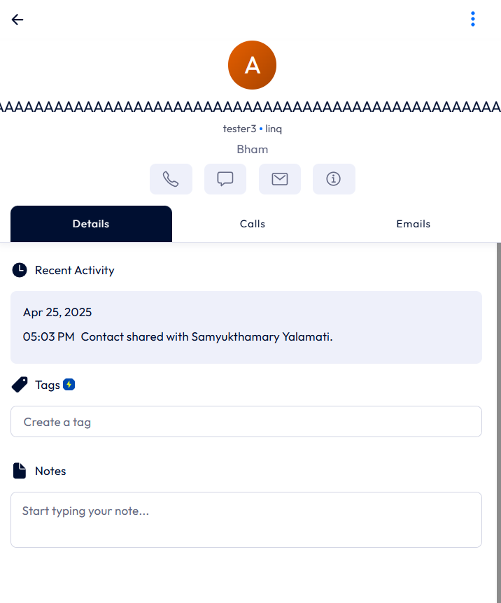
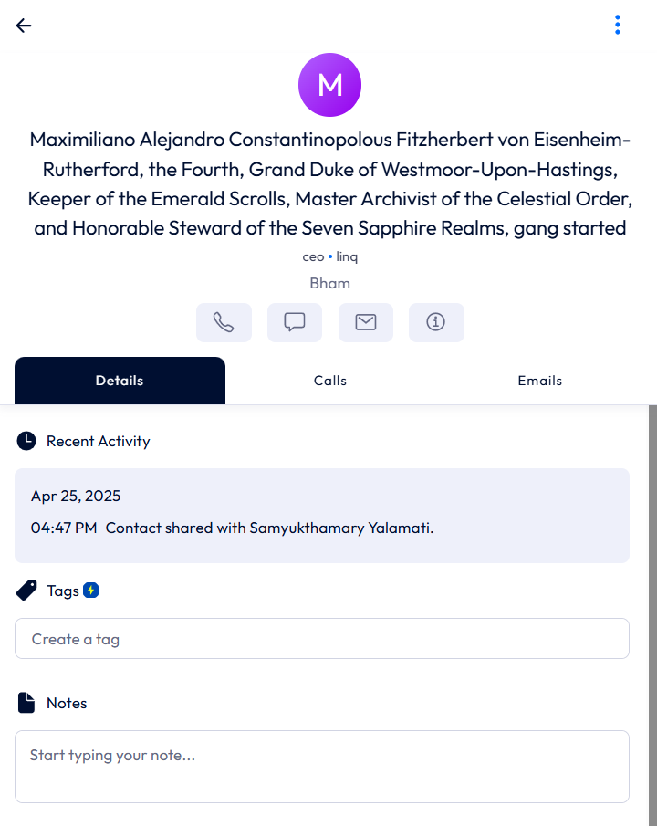

# Bug Reports For Linq Visitor Flow

**Bug ID**: BUG001

**Title**: Contact saved without a name (empty name field)

**Test Case Reference ID**: NS003

**Steps to Reproduce**:
1. Navigate to "https://linqapp.com/welcome"
2. Log in or sign up using any available method
3. Once logged in,  Click on "Contacts" on the left-hand side of the page.
4. Click on "Add Person" icon located at the bottom of the page.
5. Leave the **First & Last Name** field empty. 
6. Fill all the other required field - "Phone Number" , "Email" , "Job Title" , "Organization / Company" , "Location".
7. Click the "Save Changes" button on the bottom of the form.

**Expected Result**: A validation error should appear like "The name is a required field!"

**Actual Result**: Contact is saved successfully, no validation error was shown for the empty name field.

**Severity**: Medium

**Screenshots**:

**Bug ID**: BUG002

**Title**: Contact saved successfully with invalid phone number

**Test Case Reference ID**: NS005

**Steps to Reproduce**:
1. Navigate to "https://linqapp.com/welcome"
2. Log in or sign up using any available method
3. Once logged in,  Click on "Contacts" on the left-hand side of the page.
4. Click on "Add Person" icon located at the bottom of the page.
5. Fill all the required field - "First & Last Name", "Phone Number" , "Email" , "Job Title" , "Organization / Company" , "Location".
6. Fill the phone number field with invalid formate or too short/long input.
7. Click the "Save Changes" button on the bottom of the form.

**Expected Result**: A validation error message should appear indicating that the phone number format is invalid, and the contact should not be saved.

**Actual Result**: Contact is saved successfully without any warning or error message.

**Severity**: Medium

**Screenshots**:

**Bug ID**: BUG003

**Title**: Contact saved with 255+ characters in the name filed

**Test Case Reference ID**: ES001

**Steps to Reproduce**:
1. Navigate to "https://linqapp.com/welcome"
2. Log in or sign up using any available method
3. Once logged in,  Click on "Contacts" on the left-hand side of the page.
4. Click on "Add Person" icon located at the bottom of the page.
5. fill  the **First & Last Name** field with 255+ characters. 
6. Fill all the other required field - "Phone Number" , "Email" , "Job Title" , "Organization / Company" , "Location".
7. Click the "Save Changes" button on the bottom of the form.

**Expected Result**: An appropriate error message should be displayed(e.g. "Name too long")

**Actual Result**: Contact is saved successfully, no error was shown for the long name field.

**Severity**: Medium

**Screenshots**:

**Bug ID**: UI001

**Title**: Incorrect heading displayed when verifying phone number signup

**Test Case Reference ID**: TS001

**Steps to Reproduce**:
1. Navigate to https://linqapp.com/welcome.
2. Select Sign Up with Phone Number option.
3. Enter a phone number and click Continue.
4. Check the heading displayed on the verification page.

**Expected Result**: The heading should read "Confirm OTP" or "Verify Phone Number"

**Actual Result**: The heading incorrectly says "Confirm Email", even though the user is verifying a phone number.

**Severity**: Medium

**Screenshots**:

