# postman-notes

## Steps to inspect API Calls (Saving contact using POST)
1. open chrome developer tools: Right-Click and select "Inspect" option.
2. Select the Network tab
3. Navigate to https://linqapp.com/welcome and login
4. Open contacts and click on "Add person icon" on the bottom of the page.
5. Fill all the required fields and click "Save Changes" button.
6. Look for a POST request inside the developer tools sent to https://api.linqapp.com/api/v2/contacts in the headers section (In my case I found it under contacts/headers)
7. copy the "Request URL" and "API-Token" under the headers tab and method should be "Request Method: POST"
8. Navigate to payload tab and copy the payload(Json format)
9. Navigate to Response tab and check for the response 
10. Now open Postman and start new HTTP Request
11. select "Method: POST" and enter "Endpoint: https://api.linqapp.com/api/v2/contacts", "Headers: Content-Type: application/json, Accept: application/json, x-linq-api-token: 8cb84c71-78f5-4e7a-9316-edd2193ca814".
12. Enter Payload under Body section Raw->Json - 
    {
        "company": "linq",
        "email": "test10@gmail.com",
        "first_name": "test10",
        "full_name": "test10",
        "last_name": "",
        "location": "ny",
        "phone_number": "+17745543346",
        "title": "test10"
    }
13. click on send button 
14. Responded output should be a "200 ok: Request successful. The server has responded as required."

## API Request detais:
```
**Method**: POST
**Endpoint**:https://api.linqapp.com/api/v2/contacts
**Header**:
-Content-Type: application/json
-Accept: application/json
-x-linq-api-token: 8cb84c71-78f5-4e7a-9316-edd2193ca814
**Payload**:
 json
{
    "company": "linq",
    "email": "test10@gmail.com",
    "first_name": "test10",
    "full_name": "test10",
    "last_name": "",
    "location": "ny",
    "phone_number": "+17745543346",
    "title": "test10"
}
**Response**: 200 ok: Request successful. The server has responded as required.
{
    "contact": {
        "id": 2614773,
        "first_name": "test10",
        "last_name": "",
        "phone_number": "+17745543346",
        "location": "ny",
        "email": "test10@gmail.com",
        "company": "linq",
        "title": "test10",
        "image_url": null,
        "deleted_at": null,
        "created_at": "2025-04-26T23:33:21.790-05:00",
        "updated_at": "2025-04-26T23:33:21.790-05:00",
        "synced_via_hr": false,
        "override_hr_synced": true
    },
    "user_contact_id": 3603899,
    "user_contact_search": {
        "id": 3596024,
        "contact_id": 2614773,
        "user_contact_id": 3603899,
        "contact_first_name": "test10",
        "contact_last_name": "",
        "contact_phone_number": "7745543346",
        "contact_location": "ny",
        "contact_email": "test10@gmail.com",
        "contact_company": "linq",
        "contact_title": "test10",
        "contact_notes": null,
        "form_field_values": null,
        "created_at": "2025-04-26T23:33:21.791-05:00",
        "updated_at": "2025-04-26T23:33:21.791-05:00",
        "search_tsvector": "'7745543346':2B 'linq':5 'ny':4C 'test10':1A,6 'test10@gmail.com':3B",
        "synced_to_crm": false,
        "shared": false,
        "contact_image_url": null,
        "user_id": 569681,
        "user_contact_created_at": "2025-04-26T23:33:21.798-05:00",
        "private": false,
        "tsvector_search": "'7745543346':2B 'linq':5 'ny':4C 'test10':1A,6 'test10@gmail.com':3B",
        "committed": true,
        "organization_id": null,
        "team_ids": []
    }
}

**Screenshot**:
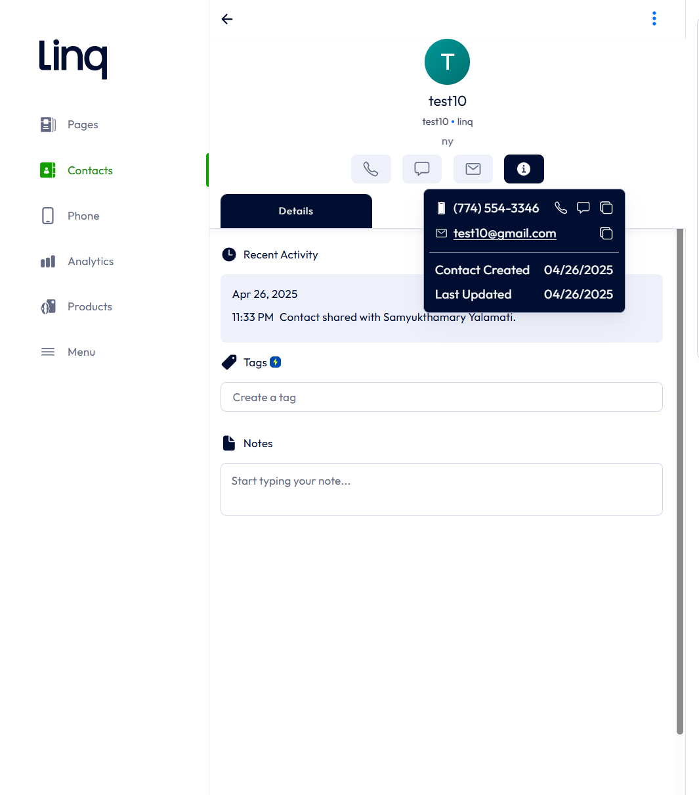 
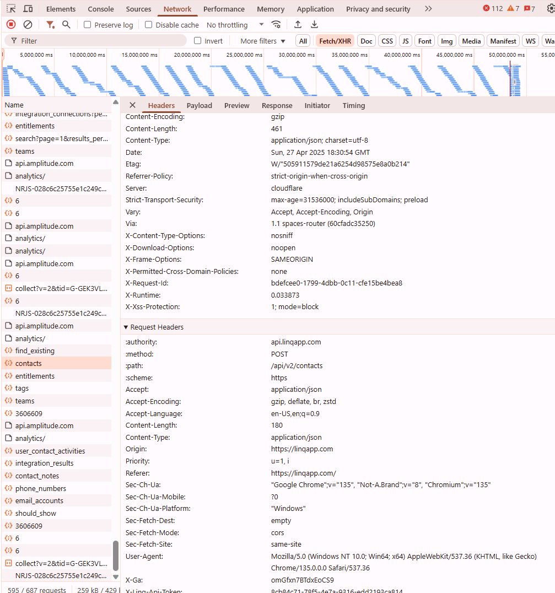 
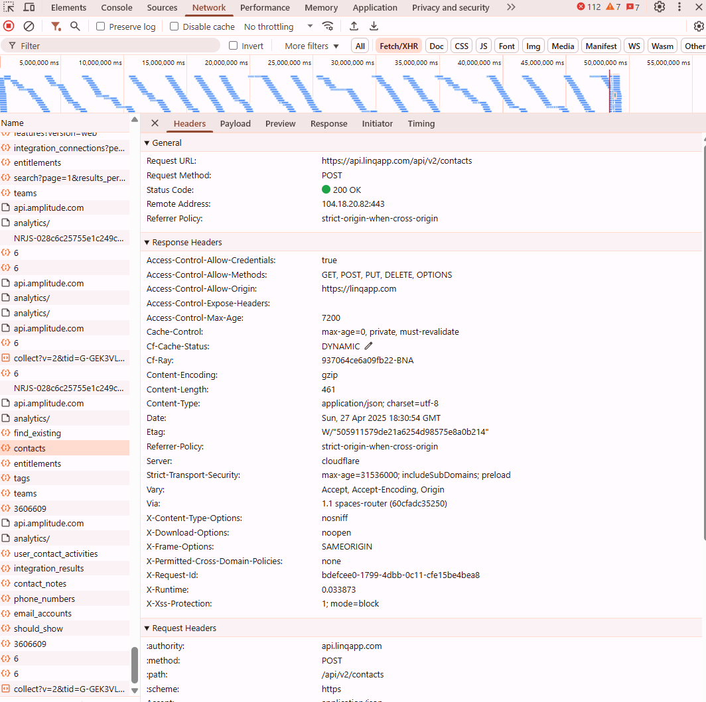 
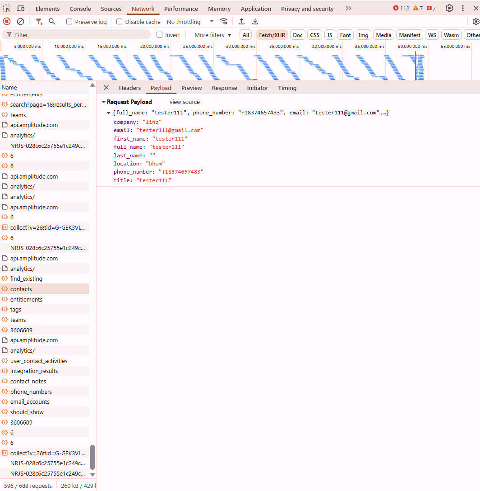 
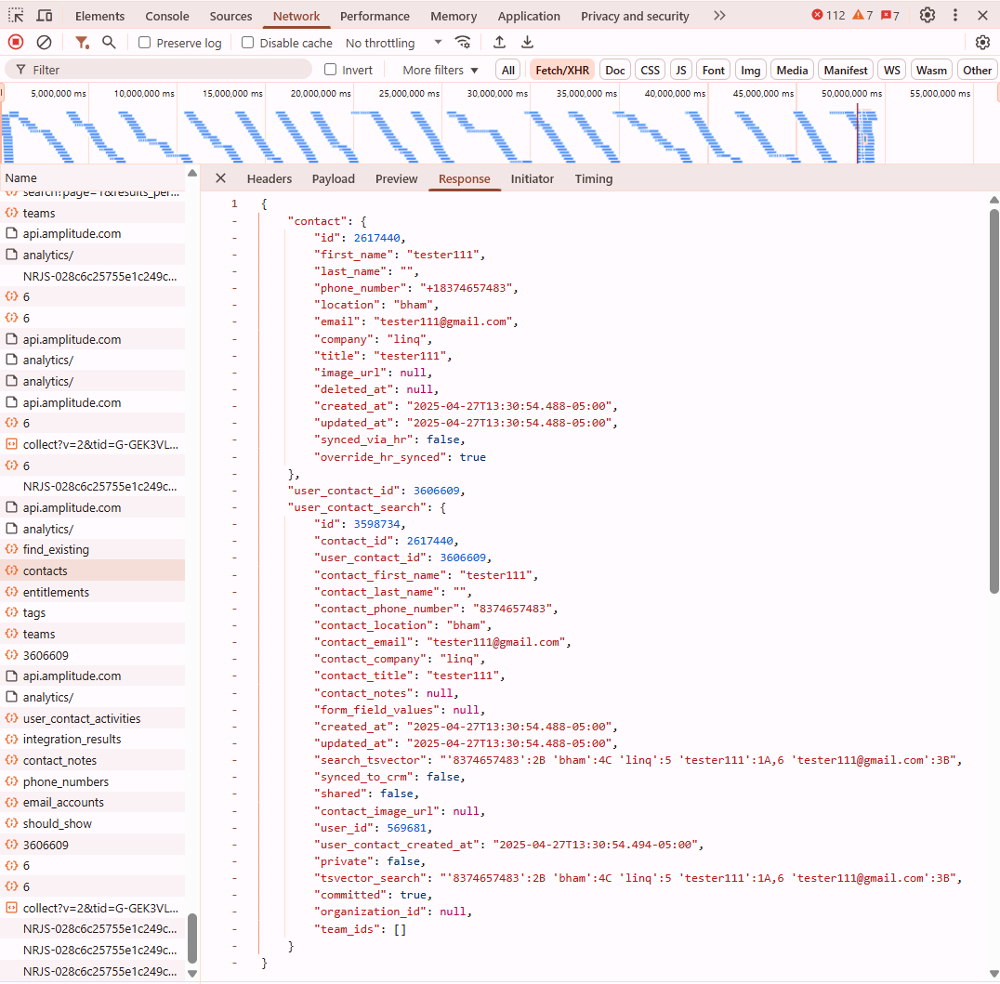 
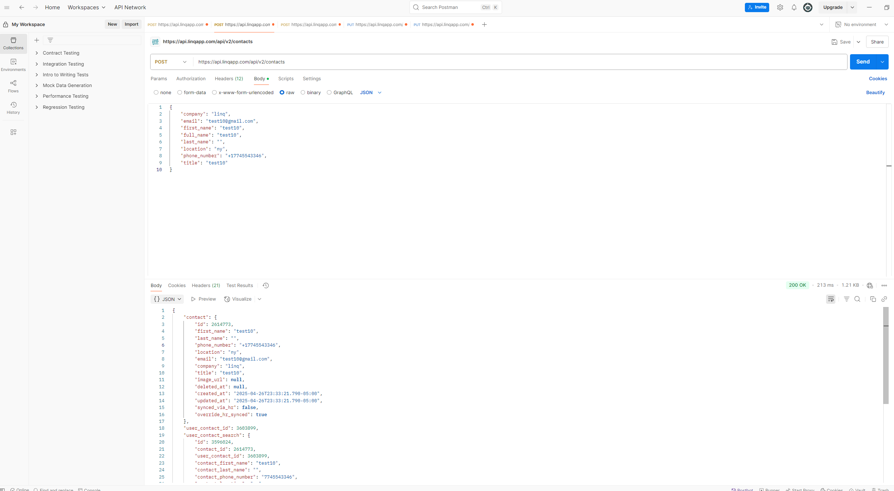
```


## Steps to inspect API Calls (Viewing Profile information using GET)
1. open chrome developer tools: Right-Click and select "Inspect" option.
2. Select the Network tab
3. Navigate to https://linqapp.com/welcome and login
4. Look for a GET request inside the developer tools sent to https://api.linqapp.com/api/v2/contacts/2580327 in the headers section.
5. copy the "Request URL" and "API-Token" under the headers tab and method should be "Request Method: GET"
6. Navigate to Response tab and check for the response 
7. Now open Postman and start new HTTP Request
8. select "Method: GET" and enter "Endpoint: https://api.linqapp.com/api/v2/contacts/2580327", "Headers: x-linq-api-token: 8cb84c71-78f5-4e7a-9316-edd2193ca814".
9. click on send button 
10. Responded output should be a "200 ok: Request successful. The server has responded as required." with the details same as in Response tab.

## API Request detais:
```
**Method**: GET
**Endpoint**:https://api.linqapp.com/api/v2/contacts/2580327
**Header**:
-x-linq-api-token: 8cb84c71-78f5-4e7a-9316-edd2193ca814
**Response**: 200 ok: Request successful. The server has responded as required.
- {
    "data": {
        "contact": {
            "id": 2580327,
            "first_name": "Samyukthamary",
            "last_name": "Yalamati",
            "phone_number": "+16143763159",
            "email": "syalamati99@gmail.com",
            "company": null,
            "title": null,
            "location": null,
            "full_name": "Samyukthamary Yalamati",
            "small_image_url": null,
            "synced_via_hr": false,
            "override_hr_synced": true,
            "card_id": 642498,
            "card_viewing_code": "ar2qsw8fanrk",
            "card_connecting_url": "https://linqapp.com/samyukthamary_yalamati",
            "card_connecting_code": "samyukthamary_yalamati",
            "edit_contact_info_allowed": true,
            "edit_profile_photo_allowed": true,
            "image_url": null,
            "contact_fields": [],
            "form_fields": [],
            "hr_enabled": null,
            "name_synced": false,
            "location_synced": false,
            "phone_number_synced": false,
            "title_synced": false,
            "company_synced": false,
            "email_synced": false,
            "image_synced": false,
            "workos_directory_user": null
        }
    }
}

**Screenshot**:
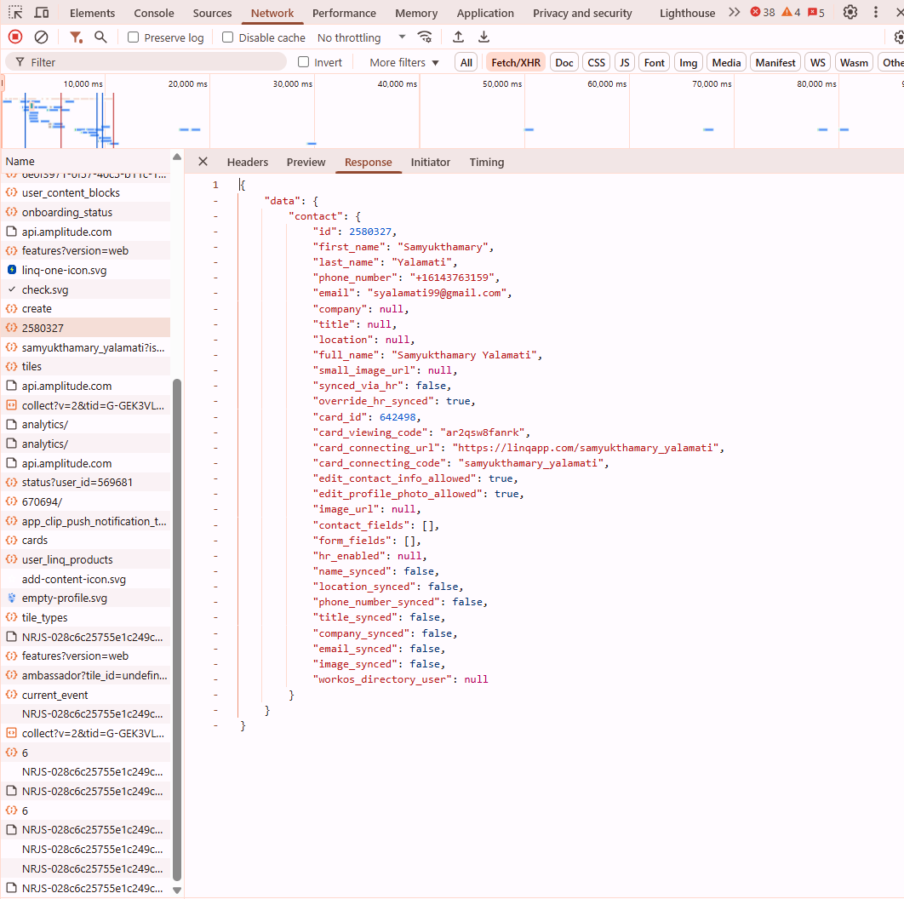 
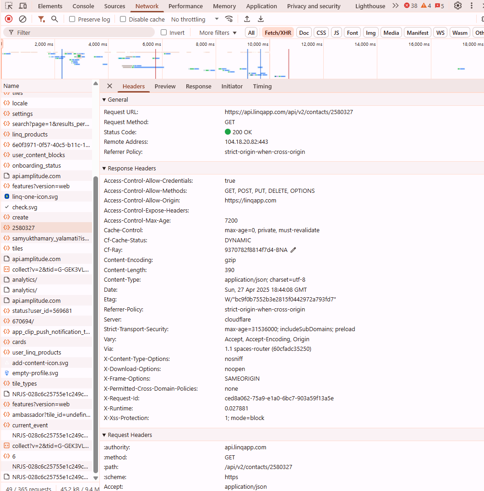 
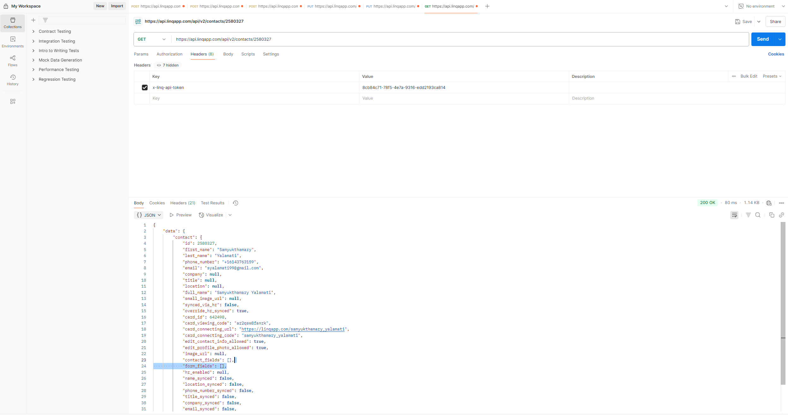
```


## Steps to inspect API Calls (Viewing Profile contacts)
1. open chrome developer tools: Right-Click and select "Inspect" option.
2. Select the Network tab
3. Navigate to https://linqapp.com/welcome and login
4. Open contacts and Look for a POST request inside the developer tools sent to https://api.linqapp.com/api/v3/user_contacts/search?page=1&results_per_page=24 in the headers section.
5. copy the "Request URL" and "API-Token" under the headers tab and method should be "Request Method: POST"
6. Navigate to Response tab and check for the response 
7. Now open Postman and start new HTTP Request
8. select "Method: POST" and enter "Endpoint: https://api.linqapp.com/api/v3/user_contacts/search?page=1&results_per_page=24", "Headers: x-linq-api-token: 8cb84c71-78f5-4e7a-9316-edd2193ca814".
9. click on send button 
10. Responded output should be a "200 ok: Request successful. The server has responded as required." with the details same as in Response tab.

## API Request detais:
```
**Method**: POST
**Endpoint**:https://api.linqapp.com/api/v3/user_contacts/search?page=1&results_per_page=24
**Header**:
-x-linq-api-token: 8cb84c71-78f5-4e7a-9316-edd2193ca814
**Response**: 200 ok: Request successful. The server has responded as required.
- {
    "data": {
        "user_contacts": [
            {
                "id": 3598734,
                "contact_id": 2617440,
                "user_contact_id": 3606609,
                "user_id": 569681,
                "contact_first_name": "tester111",
                "contact_last_name": "",
                "contact_company": "linq",
                "contact_phone_number": "8374657483",
                "contact_title": "tester111",
                "contact_image_url": null,
                "synced_to_crm": false,
                "shared": false,
                "tags": [],
                "tasks": []
            },
            {
                "id": 3596024,
                "contact_id": 2614773,
                "user_contact_id": 3603899,
                "user_id": 569681,
                "contact_first_name": "test10",
                "contact_last_name": "",
                "contact_company": "linq",
                "contact_phone_number": "7745543346",
                "contact_title": "test10",
                "contact_image_url": null,
                "synced_to_crm": false,
                "shared": false,
                "tags": [],
                "tasks": []
            },.....]}}

**Screenshot**:
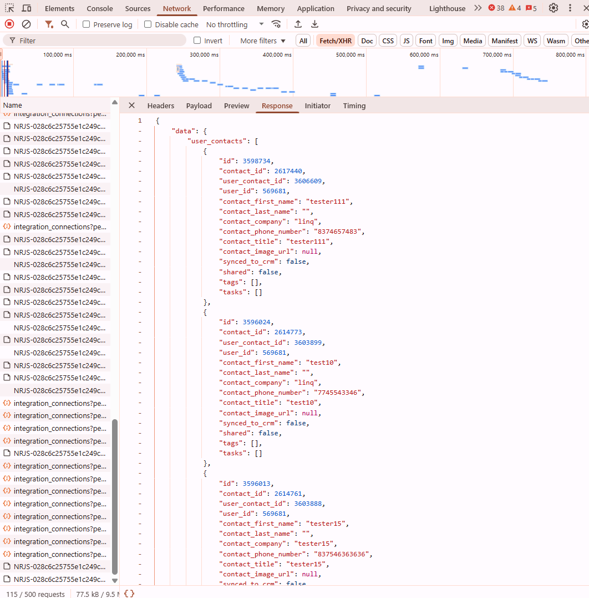 
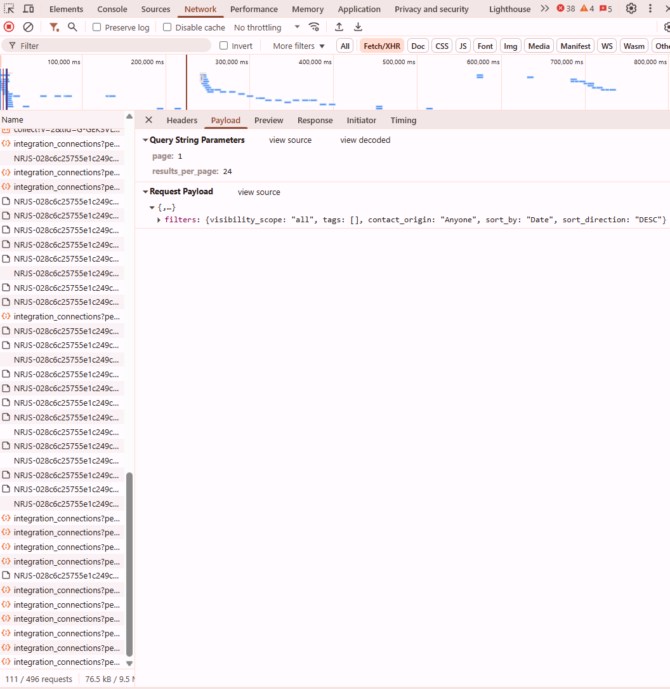 
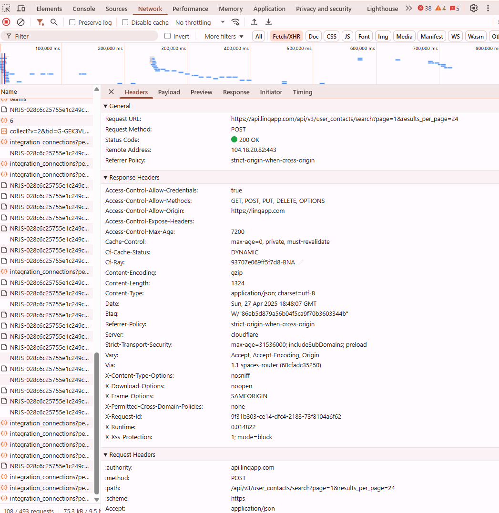 
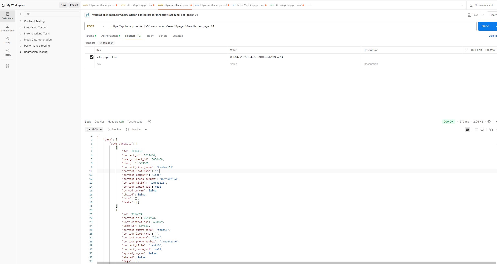
```


## Steps to inspect API Calls (Updating Saved contact)
1. open chrome developer tools: Right-Click and select "Inspect" option.
2. Select the Network tab
3. Navigate to https://linqapp.com/welcome and login
4. Open contacts and Try to Update a contact
5. Look for a PUT request inside the developer tools sent to https://api.linqapp.com/api/v2/contacts/2612463?user_id=569681 in the headers section.
6. copy the "Request URL" and "API-Token" under the headers tab and method should be "Request Method: PUT"
7. Navigate to Response tab and check for the response 
8. Now open Postman and start new HTTP Request
9. select "Method: PUT" and enter "Endpoint: https://api.linqapp.com/api/v2/contacts/2612463?user_id=569681", "Headers: x-linq-api-token: 8cb84c71-78f5-4e7a-9316-edd2193ca814".
10. click on send button 
11. Responded output should be a "200 ok: Request successful. The server has responded as required." with the details same as in Response tab.

## API Request detais:
```
**Method**: PUT
**Endpoint**:https://api.linqapp.com/api/v2/contacts/2612463?user_id=569681
**Header**:
-x-linq-api-token: 8cb84c71-78f5-4e7a-9316-edd2193ca814
**Response**: 200 ok: Request successful. The server has responded as required.
- {
    "data": {
        "contact": {
            "id": 2612463,
            "first_name": "test101",
            "last_name": "",
            "phone_number": "+17745543346",
            "email": "test101@gmail.com",
            "company": "linq",
            "title": "test101",
            "location": "ny",
            "full_name": "test101",
            "small_image_url": null,
            "synced_via_hr": false,
            "override_hr_synced": true,
            "card_id": null,
            "card_viewing_code": null,
            "card_connecting_url": null,
            "card_connecting_code": null,
            "edit_contact_info_allowed": null,
            "edit_profile_photo_allowed": null,
            "image_url": null,
            "contact_fields": [],
            "form_fields": [],
            "hr_enabled": null,
            "name_synced": false,
            "location_synced": false,
            "phone_number_synced": false,
            "title_synced": false,
            "company_synced": false,
            "email_synced": false,
            "image_synced": false,
            "workos_directory_user": null
        }
    }
}

**Screenshot**:
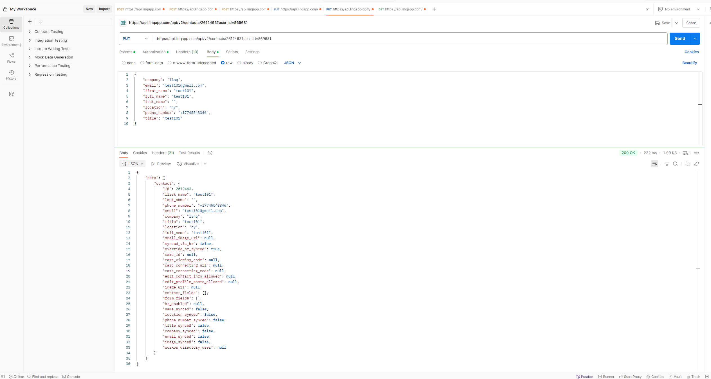 
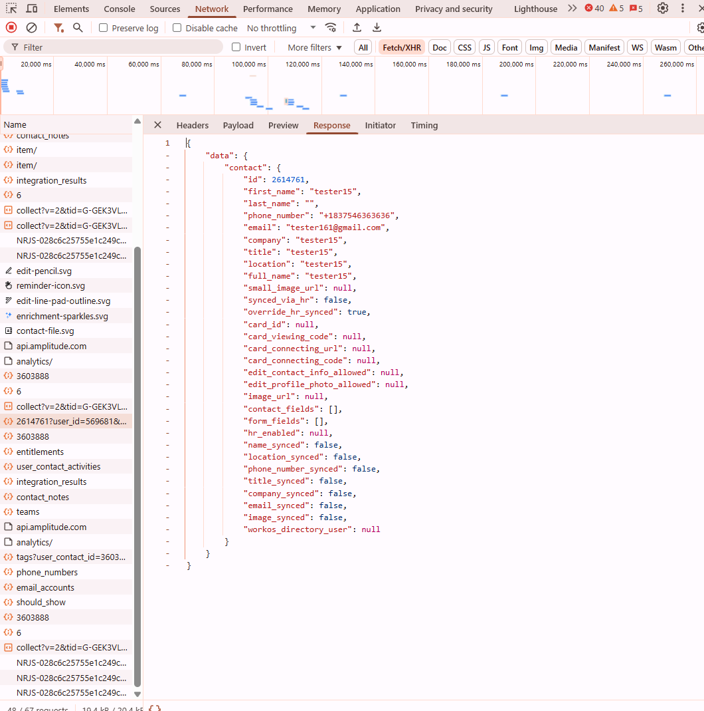 
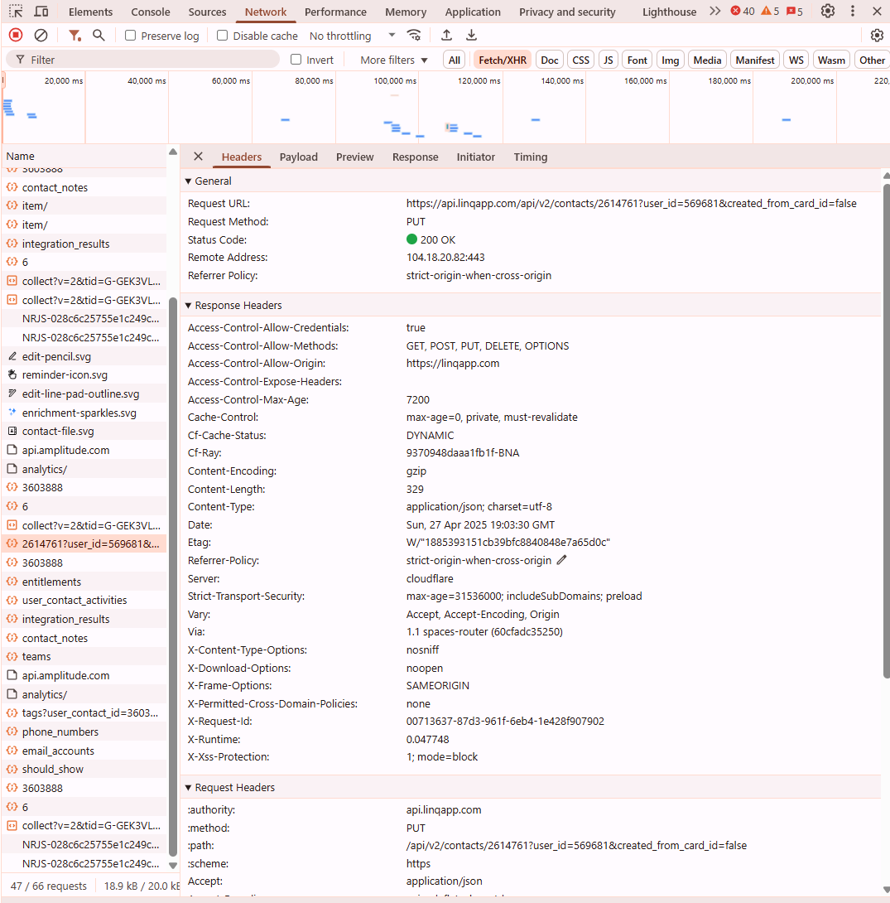
```


## Findings & Observations:

1. **API Authentication uses API Token instead of Authorization Bearer Token.**
    In the tested APIs, authentication is handled by passing a custom header x-linq-api-token with the API token value. Typically, modern APIs use an Authorization: Bearer token  header for security and standardization purposes. Using x-linq-api-token instead of Authorization: Bearer is a non-standard approach.
2. **Using POST Request to Fetch Contact List Instead of GET**
    To retrieve all user contacts (https://api.linqapp.com/api/v3/user_contacts/search?page=1&results_per_page=24), the API uses a POST request instead of a GET request. Normally, retrieval operations should use the GET method according to RESTful API best practices. POST is generally used when creating not fetching.